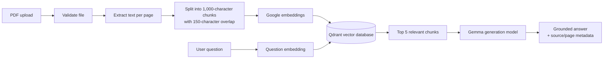

# DocRAG — Grounded answers from your documents

DocRAG is a document question-answering application built for a simple problem:
important information is often trapped inside long PDFs, and finding one reliable
answer means manually searching, reading, and cross-checking the document.

DocRAG turns that process into a focused workflow: upload a PDF, index its content,
ask a question in plain language, and receive an answer grounded in the most relevant
passages—with the source document and page information shown alongside the answer.

## The problem

Traditional keyword search is useful when the user already knows the exact words to
look for. It is less useful when the user has a natural-language question such as:

> What are the main risks described in this report?

The challenge is not only finding similar text. A useful system must also:

- process a document into searchable pieces;
- understand the meaning of the question, not only matching words;
- give the language model the relevant evidence instead of the entire document;
- reduce unsupported or hallucinated answers; and
- show where the answer came from so the user can verify it.

## The solution

DocRAG uses retrieval-augmented generation (RAG). The application separates the
workflow into two phases:

1. **Indexing:** extract PDF text, split it into overlapping chunks, create embeddings,
   and store the vectors plus source metadata in Qdrant.
2. **Question answering:** embed the user's question, retrieve the five closest chunks,
   and ask Gemma to answer using only those retrieved passages.



## End-to-end pipeline

### 1. Upload and validation

The web interface accepts PDF files up to 10 MB. The API validates the MIME type,
file extension, file size, and the `%PDF-` file signature before processing it.

### 2. Text extraction

`PDFLoader` extracts text page by page. Keeping page boundaries allows each chunk to
retain the page number used later for source display.

### 3. Chunking

Text is normalized and divided into 1,000-character chunks with 150 characters of
overlap. Overlap helps preserve context when an important sentence crosses a chunk
boundary.

Each stored chunk includes metadata such as:

```text
source: original PDF filename
page: source page number
chunk: chunk index within the page
```

### 4. Embedding and indexing

Google's `gemini-embedding-001` model converts each chunk into a vector. LangChain's
Qdrant integration stores the vectors and document metadata in the local
`doc_rag_documents` collection.

### 5. Retrieval

When a question arrives, it is embedded with the same embedding model. Qdrant uses
vector similarity to return the five most relevant chunks.

### 6. Grounded generation

Only the retrieved chunks are sent to the configured Gemma model. The system prompt
instructs the model to use only that context, say when the answer cannot be found in
the indexed document, and mention relevant pages when possible.

The API returns both the answer and the source metadata used for retrieval, making the
result easier to inspect and trust.

## Architecture

```text
Browser
  │
  ├── POST /api/index ──> Next.js route
  │                         ├── PDFLoader + chunking
  │                         ├── Google embeddings
  │                         └── Qdrant collection
  │
  └── POST /api/chat ───> Next.js route
                            ├── Google question embedding
                            ├── Qdrant similarity search (top 5)
                            └── Gemma answer generation
```

The application is intentionally small and uses one orchestration path:

- **Next.js + TypeScript** — web UI and server-side API routes;
- **LangChain** — PDF loading, embeddings, vector-store integration, and model calls;
- **Google GenAI through LangChain** — embeddings and Gemma generation;
- **Qdrant** — local vector database running with Docker Compose;
- **React Markdown** — rendering model answers in the chat interface.

## Demo flow for mentors

1. Start Qdrant and the Next.js app.
2. Open `http://localhost:3000`.
3. Upload a text-based PDF, such as a report, policy, or technical document.
4. Select **Add to notebook** and wait for the page/chunk summary.
5. Ask a question whose answer is clearly present in the document.
6. Inspect the answer and the displayed source/page references.
7. Ask a question that is not covered by the PDF to see the grounded fallback behavior.

The separate `/chat` route provides the retrieval chat view after a document has been
indexed.

## Run locally

### Prerequisites

- Node.js 20 or newer;
- Docker Desktop with Docker Compose; and
- a Google API key with access to the configured embedding and generation models.

### Install

```bash
npm install
```

### Configure environment variables

Create `.env.local` in the project root:

```env
GOOGLE_API_KEY=your_google_api_key
GOOGLE_EMBEDDING_MODEL=gemini-embedding-001
GOOGLE_GENERATION_MODEL=gemma-4-26b-a4b-it
QDRANT_URL=http://localhost:6333
QDRANT_COLLECTION=doc_rag_documents
# QDRANT_API_KEY=        # optional for a secured Qdrant deployment
```

Do not commit `.env.local`, API keys, or other credentials.

### Start Qdrant

```bash
docker compose up -d qdrant
curl http://localhost:6333/readyz
```

The local Qdrant endpoints are:

- REST API: `http://localhost:6333`;
- dashboard: `http://localhost:6333/dashboard`; and
- gRPC: `localhost:6334`.

Qdrant data is persisted in the Docker volume `doc_rag_qdrant_storage`.

### Start the application

```bash
npm run dev
```

Open [http://localhost:3000](http://localhost:3000).

## API overview

### `POST /api/index`

Accepts a multipart form upload with a `file` field containing a PDF.

Successful response:

```json
{
  "ok": true,
  "pages": 12,
  "chunks": 48,
  "collection": "doc_rag_documents"
}
```

### `POST /api/chat`

Accepts a JSON body with a question:

```json
{ "question": "What are the main recommendations?" }
```

The response contains the grounded answer and the retrieved source/page records:

```json
{
  "ok": true,
  "answer": "...",
  "sources": [
    { "source": "report.pdf", "page": 4, "score": 0.82 }
  ]
}
```

## Current scope and limitations

This is an intentionally focused hackathon implementation:

- PDF files only;
- text-based PDFs are supported best; scanned PDFs require OCR, which is not included;
- one local Qdrant collection is used by default;
- the upload limit is 10 MB;
- indexing is currently an in-memory request workflow with no user accounts or job queue;
- answers depend on the quality of extracted text, chunking, embeddings, and retrieved context;
- there is no hosted deployment or multi-user isolation yet.

## Validation

Run the available checks with:

```bash
npm run lint
npm run typecheck
npm test
npm run build
```

The unit tests cover PDF validation, PDF signatures, chunking behavior, and question
validation. The Qdrant readiness endpoint should be checked before testing indexing or
retrieval end to end.

## Future improvements

The next improvements would be selected based on mentor/user feedback:

- OCR for scanned PDFs;
- document deletion and collection management;
- streaming answers and richer citations;
- hybrid keyword plus vector retrieval;
- evaluation datasets for retrieval quality and answer faithfulness;
- authentication and per-user document isolation; and
- background indexing for larger documents.

## Project structure

```text
src/app/page.tsx             Upload and primary notebook UI
src/app/chat/page.tsx        Retrieval chat UI
src/app/api/index/route.ts   PDF indexing endpoint
src/app/api/chat/route.ts    Question-answering endpoint
src/lib/indexing.ts           PDF validation, extraction, chunking, indexing
src/lib/retrieval.ts          Similarity search and grounded generation
docker-compose.yml            Local Qdrant service
```

## License and project notes

This project is a hackathon prototype. Review the model and dependency licenses before
using it in a production or commercial setting.
